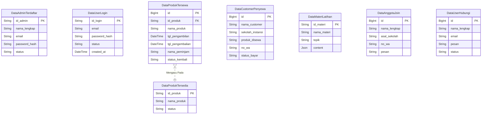

# Analisis dan Desain Sistem Informasi Ambalan

Dokumen ini berisi rancangan sistem yang meliputi **Entity Relationship Diagram (ERD)**, **Use Case Diagram**, dan **Data Flow Diagram (DFD)** Level 0 dan 1.

Anda dapat menggunakan diagram di bawah ini untuk kebutuhan laporan atau dokumentasi proyek. (Diagram dirender menggunakan Mermaid JS).

---

## 1. Entity Relationship Diagram (ERD)

ERD menggambarkan struktur database dan hubungan antar data dalam sistem. Berdasarkan `schema.prisma` yang digunakan:



### Penjelasan ERD
1.  **DataAdminTerdaftar**: Menyimpan data administrator yang memiliki akses penuh ke Dashboard.
2.  **DataUserLogin**: Menyimpan data user umum yang mendaftar ke sistem untuk mengakses fitur member.
3.  **DataProdukTersedia**: Master data barang/inventaris milik Ambalan yang bisa disewa.
4.  **DataProdukTersewa**: Tabel transaksi pencatatan barang yang sedang dipinjam/disewa keluar.
5.  **DataCustomerPenyewa**: Data lengkap penyewa (bisa dari luar sekolah/instansi lain).
6.  **DataMateriLatihan**: Menyimpan konten edukasi kepramukaan (Sandi, Tali-temali, dll).
7.  **DataAnggotaJoin** & **DataUserHubungi**: Tabel operasional untuk menampung input formulir dari pengunjung website.

---

## 2. Use Case Diagram

Use Case menggambarkan interaksi antara Aktor (Pengguna) dengan Fitur-fitur dalam sistem.

```mermaid
usecaseDiagram
    actor "User (Pengunjung/Anggota)" as User
    actor "Administrator" as Admin

    package "Sistem Informasi Ambalan" {
        usecase "Melihat Beranda & Tentang" as UC1
        usecase "Mengakses Materi Latihan" as UC2
        usecase "Melihat Daftar Produk" as UC3
        usecase "Mengisi Form Hubungi Kami" as UC4
        usecase "Daftar Anggota Baru (Join)" as UC5
        usecase "Login / Register Akun" as UC6
        
        usecase "Dashboard Admin" as UC7
        usecase "Kelola Data Produk (CRUD)" as UC8
        usecase "Kelola Peminjaman Barang" as UC9
        usecase "Lihat Pesan Masuk & Pendaftar" as UC10
    }

    User --> UC1
    User --> UC2
    User --> UC3
    User --> UC4
    User --> UC5
    User --> UC6

    Admin --> UC6
    Admin --> UC7
    Admin --> UC8
    Admin --> UC9
    Admin --> UC10
```

### Penjelasan Use Case
*   **User** dapat mengakses informasi publik seperti profil Ambalan, materi latihan, dan katalog produk. User juga bisa berinteraksi melalui formulir pendaftaran dan kontak.
*   **Administrator** memiliki hak akses khusus (setelah Login) untuk masuk ke Dashboard. Di sana, Admin mengelola data inventaris, mencatat transaksi peminjaman, dan memantau pesan atau pendaftaran yang masuk.

---

## 3. Data Flow Diagram (DFD)

### DFD Level 0 (Context Diagram)

Menggambarkan sistem secara global sebagai satu kesatuan proses.


### DFD Level 1 (Decomposition)

Memecah sistem menjadi proses-proses utama yang lebih detail.


### Penjelasan DFD Level 1
1.  **Proses 1.0 Autentikasi**: Menangani login dan registrasi baik untuk User maupun Admin, serta memverifikasi hak akses database.
2.  **Proses 2.0 Layanan Informasi**: Mengambil data dari database (Produk & Materi) untuk ditampilkan ke pengunjung website di halaman depan.
3.  **Proses 3.0 Operasional User**: Menangani input data dari user, seperti formulir "Hubungi Kami" dan Pendaftaran Anggota Baru, lalu menyimpannya ke database transaksi.
4.  **Proses 4.0 Manajemen Admin**: Pusat kendali admin untuk mengelola (Tambah/Edit/Hapus) data produk, memproses transaksi peminjaman, dan melihat laporan pesan/pendaftaran.
